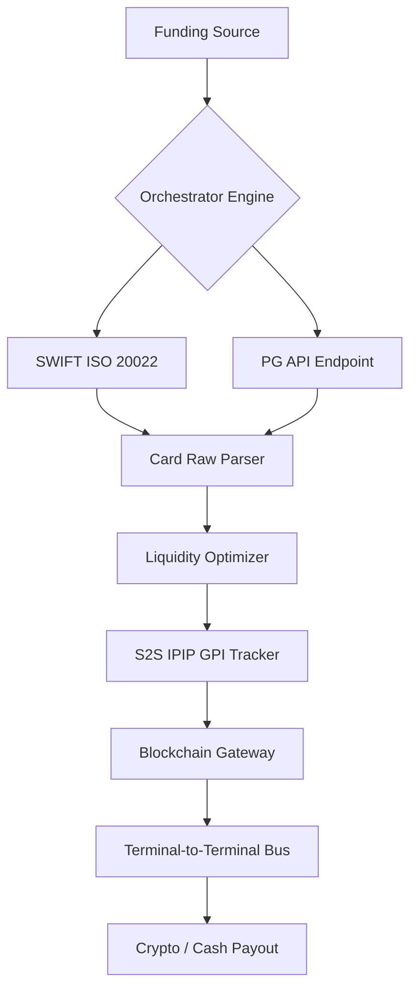
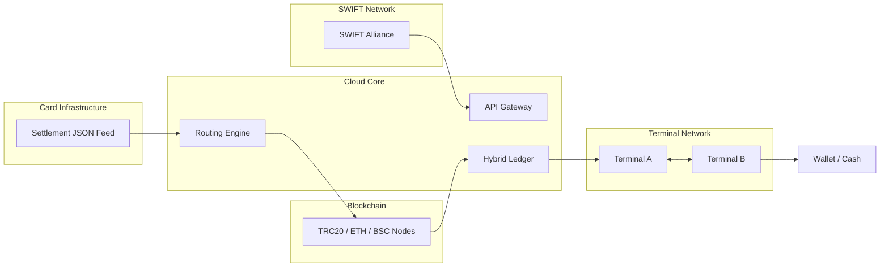
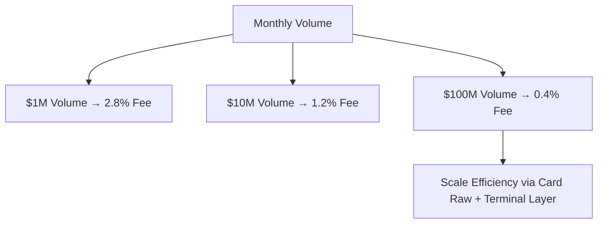
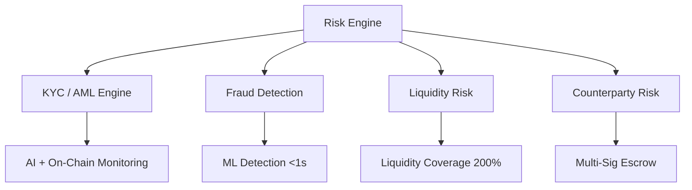
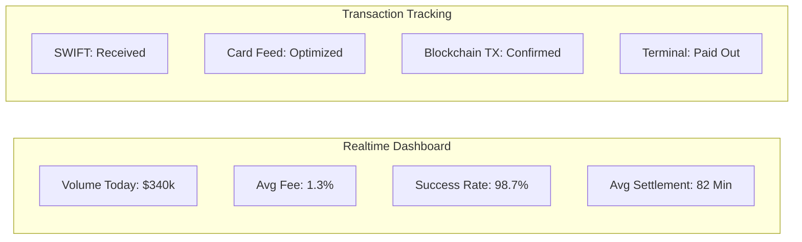
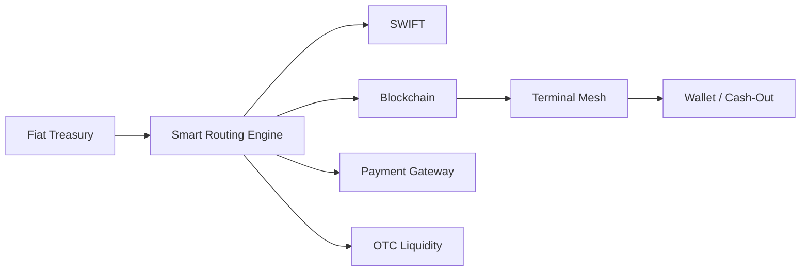

<div align="center">

# JACKSON 🌍 LUKAS

<div align="center">

---

<div align="center">

# HYBRID-CROSS-BORDER-PAYOUT-SYSTEM
🌍  SWIFT + PG + CARD RAW + BLOCKCHAIN + S2S GPI + TERMINAL-TO-TERMINAL CRYPTO PAYOUT

<div align="center">

---

<div align="center">


<br>

### *Version 1.0 — Institutional Presentation & Due Diligence Ready*

</div>

---


<div align="center">


</div>

---

# 📑 TABLE OF CONTENTS

- [1. Executive Summary](#1-executive-summary)
- [2. Real Transaction Journey](#2-real-transaction-journey)
- [3. Competitive Advantage](#3-competitive-advantage)
- [4. Cost Breakdown](#4-cost-breakdown)
- [5. System Architecture](#5-system-architecture)
- [6. Security & Risk Mitigation](#6-security--risk-mitigation)
- [7. Revenue Projection](#7-revenue-projection)
- [8. Compliance & Regulation](#8-compliance--regulation)
- [9. 12-Month Roadmap](#9-12-month-roadmap)
- [10. Investor FAQ](#10-investor-faq)
- [11. Export to PDF & GitHub](#11-export-to-pdf--github)

---


<div align="center" style="margin-top: 20px; display: flex; align-items: center; justify-content: center; gap: 15px; border-top: 1px solid #30363d; padding-top: 15px; flex-wrap: wrap; filter: brightness(1.1);">


</div>

---
# 1. Executive Summary

## 🎯 Problem Statement

Cross-border payment infrastructure today is fragmented and inefficient:

| Legacy System | Main Problems |
|---|---|
| **SWIFT** | Slow settlement (2–5 days), expensive fees, opaque routing |
| **Pure Blockchain** | Difficult fiat off-ramp, wallet dependency, volatility |
| **Traditional Payment Gateway** | Merchant-focused, not optimized for payout corridors |

---

## 💡 Our Solution

A **6-layer hybrid financial infrastructure** combining:

- SWIFT inbound settlement
- Payment Gateway API
- Card settlement raw feed optimization
- S2S IPIP GPI tracking engine
- Multi-chain blockchain settlement
- Terminal-to-terminal crypto payout network

---

## ⚡ Key Advantages

| Feature | Result |
|---|---|
| End-to-end payout | **< 90 minutes** |
| Average payout fee | **1.0% – 1.5%** |
| Crypto + Cash capability | ✅ |
| Unbanked support | ✅ |
| Real-time tracking | ✅ |
| Multi-chain support | ✅ |
| Hybrid compliance engine | ✅ |

---

## 📊 Investor Highlights

| Metric | Value |
|---|---|
| Initial PoC Volume | $2M/month |
| Target Year 1 GMV | $150M |
| Average Gross Margin | 1.2% – 2.8% |
| Settlement Speed | Up to 96% faster than SWIFT |
| Addressable Market | Global remittance + B2B payouts |

---

# 2. Real Transaction Journey

## 🌐 Use Case

> Export company in Jakarta sends USD payment to supplier in Lagos, Nigeria.

Supplier receives payout in **USDT/USDC** or cash via terminal agent.

---

## 🔄 Transaction Flow

| Step | Layer | Action | Estimated Time |
|---|---|---|---|
| 1 | SWIFT MT103 | USD transfer to pooled treasury account | 0–60 min |
| 2 | Card Raw Feed | Settlement JSON optimization for wholesale rate | 5 min |
| 3 | S2S IPIP Routing | Dynamic fee & liquidity routing | <1 sec |
| 4 | Blockchain | USDT/USDC settlement via TRC20/BSC | 15 min |
| 5 | Terminal Bus | Terminal A signs payout → Terminal B validates | 2 min |
| 6 | Final Payout | QR payout / Wallet payout / Cash-out | <1 min |

---

## ⏱ Final Result

| Metric | Traditional SWIFT | Hybrid System |
|---|---|---|
| Settlement Time | 2–5 days | **< 90 minutes** |
| Total Cost | $250+ | **~$150** |
| Transparency | Low | **Full real-time** |
| Unbanked Access | ❌ | ✅ |

---

# 3. Competitive Advantage

| Feature | SWIFT | Blockchain Only | Hybrid System |
|---|---|---|---|
| Settlement Speed | Slow | Fast | **Ultra Fast** |
| Fiat Access | ✅ | Limited | ✅ |
| Wallet Required | ❌ | ✅ | Optional |
| Cash-Out Support | ❌ | ❌ | ✅ |
| Real-Time Tracking | Partial | Technical only | ✅ |
| Regulatory Layer | Traditional | Weak | Hybrid |
| Liquidity Optimization | ❌ | Partial | ✅ |

---

## 🧠 Strategic Moat

### Core Differentiators

- **Card Raw Settlement Optimization**
- **Terminal-to-Terminal Crypto Mesh**
- **Hybrid Ledger Reconciliation**
- **Institutional Routing Intelligence**
- **Multi-Rail Settlement Infrastructure**

---

# 4. Cost Breakdown

## 💵 Example: $10,000 Nigeria Corridor

| Layer | Cost | Notes |
|---|---|---|
| SWIFT Inbound | $0 | Shared pooled settlement |
| Card Raw Feed | $0.08 | Non-linear scaling |
| Fiat → Crypto Conversion | $4.50 | OTC / DEX routing |
| Blockchain Gas | $0.80 | TRC20 optimized |
| S2S Routing | $0.10 | Infrastructure overhead |
| Terminal Agent | $2.00 | Distributed payout node |
| Wallet Payout | $0 | Direct crypto transfer |

---

## 📈 Profitability Snapshot

| Item | Value |
|---|---|
| Direct Cost | $7.48 |
| Customer Fee | $150 |
| Gross Profit | $142.52 |
| Gross Margin | 95% |

> Margin scalability is driven by infrastructure efficiency and fixed-cost terminal routing.

---

# 5. System Architecture

# 🧩 Diagram 1 — Logical Data Flow



---

# ☁️ Diagram 2 — Infrastructure Topology



---

# 📊 Diagram 3 — Economies of Scale



---

# 🛡 Diagram 4 — Risk Layer



---

# 📡 Diagram 5 — Investor Dashboard



---

# 🔄 Diagram 6 — Multi-Rail Settlement Engine



---

# 6. Security & Risk Mitigation

| Risk | Scenario | Mitigation |
|---|---|---|
| Card Feed Rejection | Access revoked by acquirer | Licensed acquiring partnership |
| Blockchain Congestion | Delayed settlement | Auto fallback routing |
| Terminal Offline | Regional outage | Multi-terminal redundancy |
| MITM Attack | S2S spoofing | Mutual TLS + signed payload |
| Stablecoin Depeg | USDC/USDT instability | OTC emergency swap |

---

## 🔐 Security Stack

- Multi-signature treasury
- HSM-backed signing
- Mutual TLS authentication
- AI fraud detection
- Real-time transaction scoring
- Hybrid ledger reconciliation
- Geo-based anomaly detection

---

# 7. Revenue Projection

## 📈 Conservative Year-1 Projection

| Quarter | Transaction Volume | Avg Fee | Gross Revenue | Operational Cost | Net Profit |
|---|---|---|---|---|---|
| Q1 | $5M | 2.0% | $100k | $60k | $40k |
| Q2 | $20M | 1.6% | $320k | $120k | $200k |
| Q3 | $60M | 1.3% | $780k | $250k | $530k |
| Q4 | $150M | 1.0% | $1.5M | $450k | $1.05M |

---

## 💰 Revenue Streams

| Stream | Description |
|---|---|
| FX Spread | 0.3% – 0.8% |
| Terminal Fees | $2 – $5/payout |
| White-Label API | $5k – $15k/month |
| Liquidity Yield | Treasury optimization |
| Institutional Routing | Premium corridor pricing |

---

# 8. Compliance & Regulation

## 🌍 Initial Jurisdictions

| Region | Purpose |
|---|---|
| Singapore | Payment Licensing |
| Lithuania | SEPA + EMI Access |
| Wyoming (USA) | Digital Asset Compliance |

---

## ✅ Compliance Readiness

- FATF Travel Rule
- Tiered KYC framework
- On-chain AML analytics
- Transaction monitoring
- Risk-based payout control
- Source-of-funds verification

---

## 🏦 Card Raw Feed Legality

The platform operates through:

- Sponsored acquiring partners
- White-label settlement agreements
- Licensed financial intermediaries

No unauthorized card data acquisition is performed.

---

# 9. 12-Month Roadmap

## 🚀 Phase Timeline

| Month | Milestone |
|---|---|
| 1–2 | SWIFT MX Integration |
| 3–4 | Merchant Public API |
| 5–6 | Terminal Mesh Beta |
| 7–8 | Multi-Chain Expansion |
| 9–10 | White-Label Banking Partner |
| 11–12 | EU/US Licensing + Series A |

---

## 🧭 Expansion Targets

- Southeast Asia
- Africa Corridors
- LATAM Remittance
- Middle East Treasury Routing

---

# 10. Investor FAQ

## ❓ Why Hybrid Instead of Pure Blockchain?

Because enterprises still require:

- Fiat compatibility
- Regulatory compliance
- Bank interoperability
- Cash payout infrastructure

---

## ❓ What Makes This Defensible?

The defensibility lies in:

- Proprietary routing logic
- Liquidity optimization
- Terminal payout network
- Hybrid compliance architecture
- Institutional settlement orchestration

---

## ❓ How Fast Can It Scale?

Infrastructure is horizontally scalable via:

- Multi-chain nodes
- Regional payout terminals
- Treasury pooling
- API-first architecture

---

# 11. Export to PDF & GitHub

## 📦 Convert Markdown to PDF

### Install Pandoc

```bash
sudo apt update
sudo apt install pandoc wkhtmltopdf -y
```

### Export PDF

```bash
pandoc investor.md -o investor.pdf
```

---

## 🌐 Push to GitHub

```bash
git init
git add .
git commit -m "Initial investor dossier"
git branch -M main
git remote add origin https://github.com/USERNAME/REPO.git
git push -u origin main
```

---

# 🏁 Closing Statement

<div align="center">

## 🌍 Building The Next Generation  
# OF CROSS-BORDER SETTLEMENT

### Faster • Cheaper • Transparent • Hybrid • Global

---

**Hybrid Infrastructure for Modern Financial Movement**

</div>
